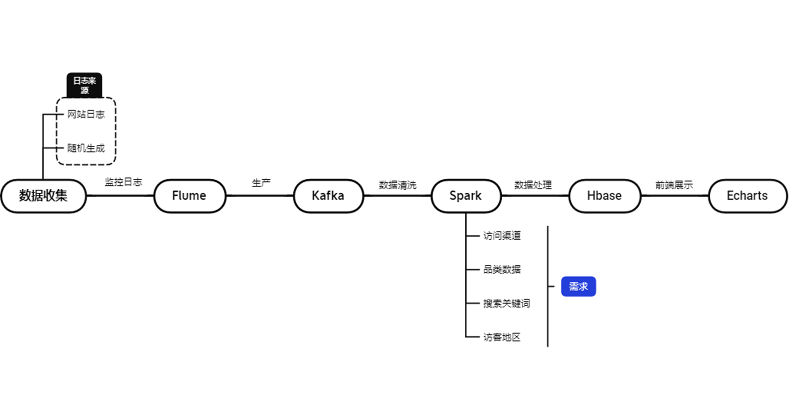
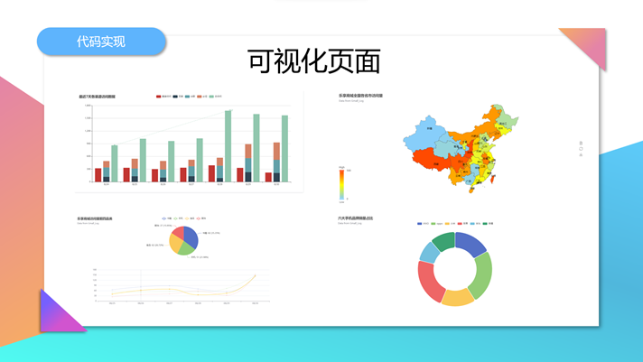

### 基于Flume + Kafka + Spark的电商实时访问日志分析系统

---

#### 项目结构



#### 1.python部分

考虑到要实时大量数据，我们利用python脚本随机产生网站log数据，数据结构如下:

```
ip time categoryId refer statusCode
124.128.8.136	2022-08-28 16:27:13	"GET gmall.com/4 HTTP/1.0"	-	404
125.58.128.237	2022-08-28 16:27:13	"GET gmall.com/1 HTTP/1.0"	https://www.google.com/web?key=苹果	200
220.160.49.229	2022-08-28 16:27:13	"GET gmall.com/1 HTTP/1.0"	-	302
58.82.124.11	2022-08-28 16:27:13	"GET gmall.com/6 HTTP/1.0"
203.134.240.136	2022-08-28 16:27:13	"GET gmall.com/3 HTTP/1.0"	-	200
203.135.160.86	2022-08-28 16:27:13	"GET phone/130 HTTP/1.0"	https://www.baidu.com/s?key=苹果	302
120.243.249.45	2022-08-28 16:27:13	"GET laptop/821 HTTP/1.0"	-	200
202.127.160.136	2022-08-28 16:27:13	"GET gmall.com/2 HTTP/1.0"	https://www.google.com/web?key=华为	200
118.102.16.23	2022-08-28 16:27:13	"GET gmall.com/1 HTTP/1.0"	https://www.baidu.com/s?key=小米	200
```

可通过定时执行和调度器工具实时产生数据

**放在虚拟机中执行，通过flume监控日志文件并传给kafka**

#### 2.spark部分

通过SparkStreaming获取，Kafka消费到的实时数据，进行数据清洗等操作，处理得到需求所需数据保存到Hbase数据库中

四条需求对应4张图

**之后用Sparingboot调用Hbase数据,通过web进行可视化相关代码放在我的商城项目里面了**

**虚拟机环境**：Ubuntu20 \ jdk8 \ hadoop3.2.2 \ scala2.12.15 \ spark3.2.0 \ Hbase2.4.13



项目参考：[https://www.bilibili.com/video/BV11E411Z7Sn?p=31&spm_id_from=333.880.my_history.page.click&vd_source=5d7574a243e53b28fc020a94b13de257](https://www.bilibili.com/video/BV11E411Z7Sn?p=31&spm_id_from=333.880.my_history.page.click&vd_source=5d7574a243e53b28fc020a94b13de257)

原项目资料：

链接：https://pan.baidu.com/s/1QAG5ybRFFCHd28YrXoPTJg 
提取码：xyxy

qq:2251634767